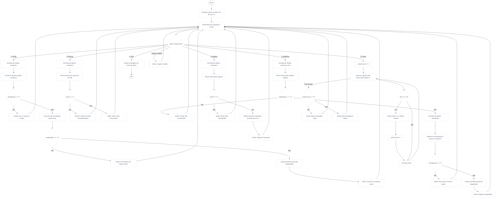

## Atividade Avaliativa 02 – Laboratório de Programação
#### Engenharia da computação UFMA | Prof. Rondineli Seba Salomão

Este documento detalha o progresso de desenvolvimento de um protótipo funcional para um sistema de banco de dados textual baseado em matrizes estáticas na linguagem C. O projeto cumpre os requisitos da segunda atividade avaliativa da disciplina de Laboratório de Programação.

---

### Análise Primária

A manipulação de coleções textuais em C, sem o uso de estruturas heterogêneas (`structs`) ou persistência em arquivos físicos, exige a modelagem de uma matriz bidimensional de caracteres que atua como um vetor de strings paralelo. 

Como a memória estática alocada na Stack retém lixo de execução, o sistema implementa uma varredura de inicialização. O controle de slots ocupados ou disponíveis é gerenciado manualmente verificando o caractere terminador nulo (`'\0'`) na primeira posição de cada linha da matriz.

Um resumo das decisões e validações implementadas até o momento compreende:
* **Inicialização de Segurança:** Isolamento de lixo de memória em todas as 50 linhas disponíveis.
* **Validação de Exclusividade:** Varredura linear preventiva via comparação de strings para impedir cadastros duplicados.
* **Gerenciamento de Espaço:** Varredura para localização do primeiro slot livre (`'\0'`) e tratamento de estouro de capacidade do banco de dados.
* **Remoção Lógica Dinâmica:** Aplicação da estratégia de limpeza recomendada, desativando o registro ao assinalar sua primeira posição com `'\0'`.
* **Formatação de Listagem:** Exibição tabular alinhada contendo apenas dados ativos com contagem dinâmica em tempo de execução.

---

### Definições Técnicas das Variáveis

| Nome da Variável | Tipo | Finalidade |
| :--- | :---: | :--- |
| `db` | char[][] | Matriz estática (50x30) que funciona como o banco de dados textual. |
| `opt` | int | Operador de escolha que direciona o fluxo do menu no bloco `switch-case`. |
| `nameAux` | char[] | Vetor auxiliar de caracteres usado como buffer para buscas, inclusões e remoções. |
| `newName` | char[] | Vetor auxiliar de caracteres usado especificamente para validar e coletar o novo nome na edição. |
| `isDuplicate` | int | Variável do tipo flag (0 ou 1) que sinaliza se um nome já existe na matriz. |
| `found` | int | Variável do tipo flag (0 ou 1) que indica o sucesso em rotinas de busca linear e remoção. |
| `emptyIndex` | int | Armazena o índice numérico da primeira linha vaga localizada na matriz (-1 se cheia). |
| `targetIndex` | int | Guarda a posição exata da linha do registro que passará por atualizações estruturais. |
| `activeCount` | int | Contador acumulador usado na listagem para rastrear a quantidade total de registros válidos. |

---

### Lógica Aplicada

1 Inicializa a matriz db preenchendo a posição db[i][0] com '\0' para todas as linhas.  
2 Entra no laço principal do Menu Interativo (do-while).  
3 Captura a opção escolhida pelo usuário (opt).  
4 Processa a opção via Switch:  
    4.1 Caso 1: Incluir Nome (Create)  
        4.1.1 Captura a string de entrada via scanf(" %[^\n]", nameAux).  
        4.1.2 Percorre a matriz comparando via strcmp() as linhas ocupadas com a entrada.  
        4.1.3 Se encontrar correspondência: isDuplicate torna-se 1 e a operação é abortada.  
        4.1.4 Se único: busca a primeira linha onde db[i][0] == '\0'.  
        4.1.5 Se não houver linha vazia (emptyIndex == -1): exibe erro de banco cheio.  
        4.1.6 Se houver vaga: copia a string com strcpy() para db[emptyIndex].  
    4.2 Caso 2: Buscar Nome (Read)  
        4.2.1 Solicita o termo de busca e realiza varredura linear nas linhas ativas.  
        4.2.2 Se encontrar: altera found para 1 e imprime o índice numérico da linha correspondente.  
        4.2.3 Se o loop terminar com found == 0: emite mensagem de registro não encontrado.  
    4.3 Caso 3: Modificar Nome (Update)  
        4.3.1 Localiza o registro antigo via busca linear. Se não encontrar, aborta.  
        4.3.2 Se encontrar: retém a posição em targetIndex e solicita o novo nome (newName).  
        4.3.3 Realiza varredura na matriz para garantir que newName não seja duplicado.  
        4.3.4 Se o novo nome for exclusivo: atualiza o índice mapeado via strcpy(db[targetIndex], newName).  
    4.4 Caso 4: Apagar Nome (Delete)  
        4.4.1 Realiza a varredura linear para localizar o nome informado pelo usuário.  
        4.4.2 Se localizado: aplica db[i][0] = '\0', invalidando sua leitura imediata e liberando a vaga.  
        4.4.3 Se não localizado: exibe alerta de erro.  
    4.5 Caso 5: Listar Todos os Nomes (Read All)  
        4.5.1 Inicializa activeCount com 0 e exibe o cabeçalho formatado da tabela.  
        4.5.2 Percorre todas as linhas verificando se db[i][0] != '\0'.  
        4.5.3 Exibe o índice alinhado e o conteúdo de cada string válida, incrementando activeCount.  
        4.5.4 Ao término, se activeCount for 0, emite alerta de banco vazio.  
    4.6 Caso 0: Altera a condição de parada e encerra a execução do programa.  

---

### Fluxograma



---

### Instalação / Compilação

O código apresentado utiliza linguagem C padrão, e pode ser executado em qualquer compilador como GCC ou utilizando IDEs como CodeBlocks, VS Code ou onlinegdb.com.

---

### Entradas e Saidas

```C
1. Incluir Nome
2. Buscar Nome
3. Modificar Nome
4. Apagar Nome
5. Listar Todos os Nomes
0. Sair
Selecione uma opcao: 1

NOVO REGISTRO
Digite o nome: Matheus Cunha
Sucesso: [0] Matheus Cunha

1. Incluir Nome
...
Selecione uma opcao: 1

NOVO REGISTRO
Digite o nome: Matheus Cunha
Erro: O nome Matheus Cunha ja existe!

1. Incluir Nome
...
Selecione uma opcao: 2

BUSCAR REGISTRO
Digite o nome para pesquisar: Matheus Cunha
Sucesso: Nome encontrado no indice [0]

1. Incluir Nome
...
Selecione uma opcao: 3

EDITAR REGISTRO
Digite o nome que deseja modificar: Matheus Cunha
Nome localizado no indice [0]. Digite o novo nome: Matheus Silva
Sucesso: Registro updated com sucesso!

1. Incluir Nome
...
Selecione uma opcao: 4

DELETAR REGISTRO
Digite o nome que deseja apagar: Matheus Silva
Sucesso: Registro removido do indice [0].

1. Incluir Nome
...
Selecione uma opcao: 5

LISTAR REGISTROS
  INDICE | NOME
------------------------------------
O banco de dados esta completamente vazio.
```

---

### Autores
Matheus Silva Cunha - 2021052782 | 
[@MSCunha](https://www.github.com/MSCunha)
### Licença

[MIT](https://choosealicense.com/licenses/mit/)


